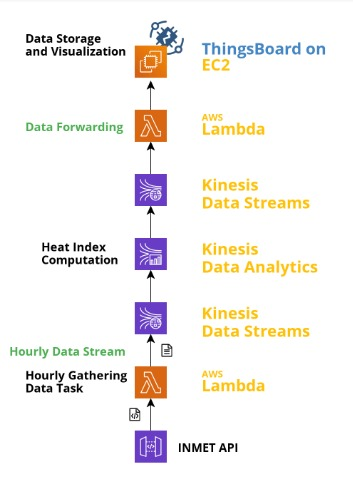

# Projeto Interdisciplinar para Sistemas de Informação IV

O objetivo deste projeto é o desenvolvimento de um sistema distribuído em nuvem, utilizando alguns dos serviços disponíveis no AWS Educate, que seja capaz de calcular o índice de calor baseado em dados meteorológicos de estações do Instituto Nacional de Meteorologia (INMET) existentes no estado de Pernambuco.

## Arquitetura

## Conteúdo

### get-kinesis

Contem os códigos utilizados na função lambda que recupera os dados da API do INMET, filtra e envia para o Kinesis Data Stream.

### process-kinesis

Com o script SQL que processa os dados enviados pela primeira função lambda, calcula o índice de calor e repassa para a segunda stream, responsável por enviar os arquivos para a segunda função lambda.

### put-kinesis

Contem os códigos utilizados na função lambda que recupera os dados do Kinesis Data Stream, monta e envia os dados para o Thingsboard.

### metrics

Contém imagens com logs de uma função lambda e de uma data stream em um período de tempo.

### Thingsboard

O dashboard de visualização do Thingsboard está disponível em http://54.90.25.87:8080/dashboards/1eea8ea0-751a-11eb-a6f3-8fd342376768
